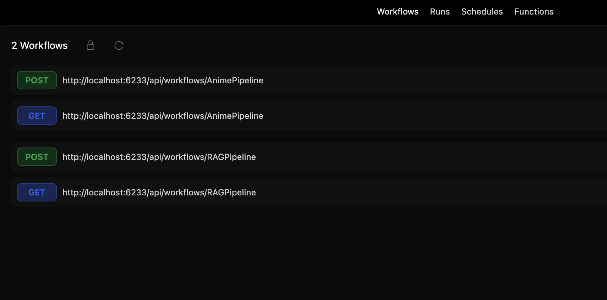
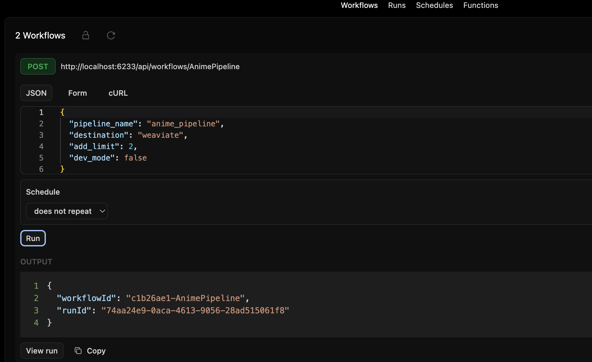
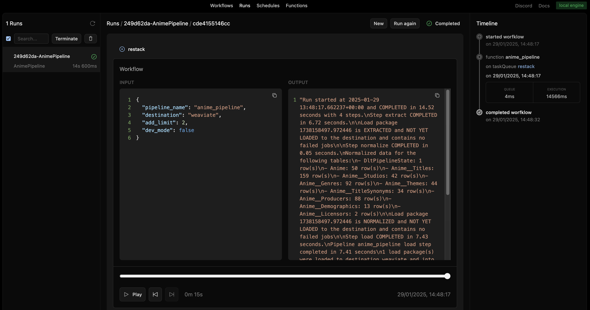
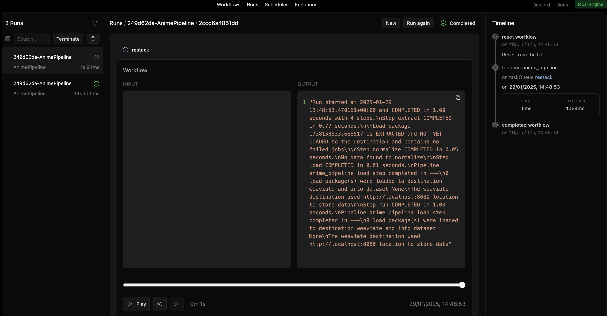
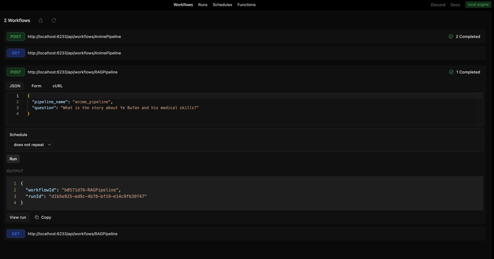
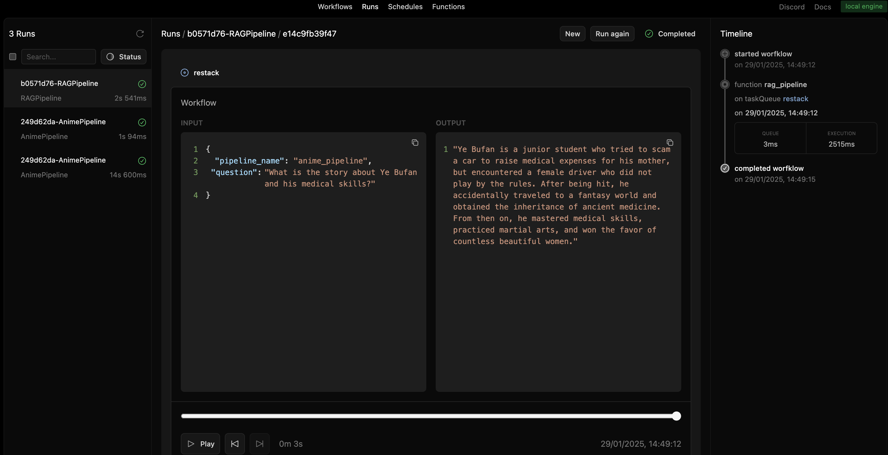

# Anime data pipeline with RAG using dlt, Restack and Weaviate

This project demonstrates how to:

- Extract and store anime data from the Jikan API into Weaviate using dlt.
- Implement a Retrieval-Augmented Generation (RAG) workflow to answer anime-related questions using OpenAI's GPT model and Weaviate's vector search.

## Start Restack

To start the Restack, use the following Docker command:

```bash
docker run -d --pull always --name restack -p 5233:5233 -p 6233:6233 -p 7233:7233 ghcr.io/restackio/restack:main
```

## Run Weaviate

```shell
docker run -p 8080:8080 -p 50051:50051  -e ENABLE_MODULES=text2vec-openai,generative-openai cr.weaviate.io/semitechnologies/weaviate:1.28.4 
```

## Add environment variables

Copy from `.dlt` the `example.secrets.toml` and rename it to `secrets.toml` and add you OpenAI key there.

```
[destination.weaviate.credentials.additional_headers]
X-OpenAI-Api-Key = "..."

[openai]
api_key = "..."
```

## Start python shell

```
cd restack-app
```

If using uv:

```bash
uv venv && source .venv/bin/activate
```

If using pip:

```bash
python -m venv .venv && source .venv/bin/activate
```

## Install dependencies

If using uv:

```bash
uv sync
uv run dev
```

If using pip:

```bash
pip install -e .
python -c "from src.services import watch_services; watch_services()"
```

## Usage

### Data ingestion pipeline

#### How it works

- Fetches incremental anime data from Jikan API.
- Handles rate limits with exponential backoff.
- Stores structured and vectorized data in Weaviate.

#### Run workflows from UI

You can run workflows from the UI by clicking the "Run" button.



You should provide input in JSON format:

| Parameter        | Type     | Description                                                                                                                                                                       |
|-----------------|---------|-----------------------------------------------------------------------------------------------------------------------------------------------------------------------------------|
| `pipeline_name` | `str`   | The name of the pipeline. It is used to restore its state and data schemas on subsequent runs.                                                                                    |
| `destination`   | `str`   | The destination where the anime data will be stored. Defaults to `"weaviate"`. You can use `duckdb` for development and debugging.                                                |
| `add_limit`     | `int`   | The maximum number of API pages to fetch and process in a single run. Defaults to 2. Set -1 if you want to fetch all data.                                                        |
| `dev_mode`      | `bool`  | When dev_mode is enabled, dlt creates a versioned dataset each time you run the pipeline. This means the data is loaded into a new dataset (a new database schema) with each run. |



#### Pipeline execution example

The pipeline finalizes the execution and logs the results, ensuring the data is successfully ingested into the destination.



#### Incremental loading

Incremental loading ensures that only new or updated data is fetched and processed when the pipeline runs again. 
Instead of reloading all data, the pipeline tracks the last processed 
timestamp (e.g., aired.from) and retrieves only new entries since that point.

If you rerun the pipeline without new data being available, 
it will detect that no new records exist and avoid unnecessary processing. 
This helps improve efficiency, reduce API requests, and minimize redundant storage.




1. **First Run** (14s 600ms Execution)

    - Extracted, normalized, and loaded anime data into Weaviate.
    - Successfully processed multiple rows and stored them in the database.
    
2. **Second Run** (1s Execution)

   - The second execution was much faster (~1 second) because no new data was available.
   - The output log confirms that no new records were found, and 0 load packages were sent to the destination.
   - This is a result of incremental loading, preventing redundant data processing.

By using incremental loading, the pipeline optimizes data ingestion by only processing new entries, making subsequent runs more efficient.


### RAG query pipeline
This pipeline allows **semantic search** on the stored anime data using Weaviate and OpenAI.  

#### How it works
1. A user asks a **question** related to anime.  
2. Weaviate retrieves relevant anime descriptions using **vector search**.  
3. OpenAI generates a **natural language answer** based on the retrieved data.  

#### Run workflows from UI

You can run workflows from the UI by clicking the "Run" button.



You should provide input in JSON format:

| Parameter      | Type    | Description  |
|---------------|--------|--------------|
| `pipeline_name` | `str` | Name of the pipeline, Defaults to `anime_pipeline`. |
| `question` | `str` | User's query for retrieving anime information. |


#### Pipeline execution example

The pipeline finalizes the execution and logs the results, ensuring the answer was successfully generated.

